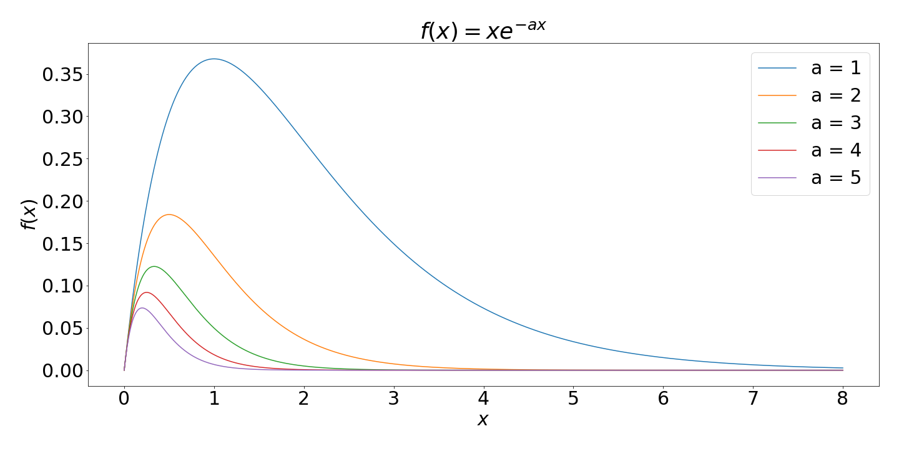

Before we get on to the main topics in this week's handout - control flow and functions - there are a couple of topics
to level up in first: using the `print()` function and a reminder of logical operators.


## The print function

We're going to be using a bit more of the `print` function today in our scripts, to help us to see what's
happening in our code.

Recall that `print()` can be used with a value (of any type) inserted directly

```python
print(5)
print("Hello")
```

It can also print more than one thing at once:

```python
print("Hello", "World")
```

It can be used to print a variable

```python
x = [1, 5, 7]
print(x)
```

But what if we want the output to be something like this, where the 5 is a variable?

```
The value is 5
```

this is going to be a string with a variable value injected into it. The way this is done is as follows:

```python
a = 5
print("The value is {}".format(a))
``` 

`{}` is a placeholder for the variable that is specified inside `format()`. If we need to insert more than one variable
then we can add them, comma-separated, inside `format()` as follows

```python
a = 5
b = 6
print("The values are {} and {}".format(a, b))
```

The placeholders can be labelled so that a variable can be inserted twice in the same string:

```python
a = 5
b = 6
print("The values are {0} and {1}. Here's the first one again...{0}".format(a, b))
```

Things start to get a little complicated if you want to specify the format of the values you are inserting.
Here's an example which prints $\pi$ and $e$ to 2 decimal places:

```python
import numpy as np
print("Some stuff to 2 decimal places... pi = {:.2f} and e = {:.2f}".format(np.pi, np.e))
# or including the labels 
print("Some stuff to 2 decimal places... pi = {0:.2f} and e = {1:.2f}".format(np.pi, np.e))
```
 
In `{0:.2f}`, the `0` is the label (so `np.pi` is inserted here), the `:` separates the label from the format
specification, `.2` is for 2 decimal places and `f` is for float.

We could spend all day talking about string formatting, and at this stage it will be easier to look up what you
want to do when you get to it; here's a [guide](https://docs.python.org/3.4/library/string.html#string-formatting){target="_blank"}
for reference later, or if you're just really keen.

## Logical operators

Recall from Handout 1 that we use logical operators to determine whether a statement is true or false

```python
x == 2
x > 2
```

Others which can be used to make up such an expression are as follows:

**Operator**   |    **Description** 
---------------|-------------------------------
<              |    Less than 
>              |    Greater than 
<=             |    Less than or equal to 
>=             |    Greater than or equal to 
==             |    Equal to 
!=             |    Not equal to
a and b        |    is a AND b 
a or b         |    is a OR b 

Here are some more examples

```python
a = 3
print(a <= 3)            # True
print(a < 5 or a > 25)   # True
print(a < 5 and a > 25)  # False
print(a % 2 == 0)        # False (is the remainder when divided by 2 zero - in other words is a even)
```

These will form an important part of the next section on control flow.

## Control Flow

This section introduces loops and if statements, part of a family of tools used by programmers and referred to
generally as control flow.

### For Loops

A 'for loop' is used when we would like to repeat a piece of code many times, usually incrementing a value so that
something slightly different happens at each iteration. 

The basic construction of a for loop is as follows:

```python
for n in range(1,6):
    # do something with n
```

Notice the syntax, importantly the colon at the end of the `for` line, and the indentation. It doesn't really matter
what the indentation is, a tab or some spaces - a Python enthusiast will tell you that 4 spaces is best - the important
thing is that you are consistent!

Go on try it without...

```python
for n in range(1,6):
# do something with n
```
Yep, you get an error!

The comment labelled "do something with n" indicates exactly that, usually you would do something with the
current value of $n$. The loop, in this case, runs 5 times, the first time $n=1$, then $n=2$ and so on until $n=5$,
and then it stops. 

So here my choice of "doing something" is to print the value of $n^2$:

```python
for n in range(1, 6):
    print(n**2)
```

We could get fancy and print some text alongside the value:

```python
for n in range(1, 6):
    print("The value squared is {}".format(n**2))
```

The `range(1,6)` could be any list, so we can do this, for example

```python
for n in [4, 1, 5, 6]:
    print(n)
```
Or even other data types,

```python
bears = ["koala", "panda", "sun"]
for x in bears:
    print(x)
```

The loop could do pretty much anything with `n`. For example here I add the values of n by initialising a variable s,
and then adding n to it at each step of the loop:

```python
# Intitialise a variable
s = 0

# Loop through adding n each time
for n in range(1, 6):
    s += n

# print final value
print(s)
```

Notice that the line break and subsequent unindent marks the end of the for loop contents.

The `s += n` adds `n` to the current `s` value and is equivalent to `s = s + n`. 

`+=` is known as an assignment operator, and there are others such as `*=` e.g. `s *= n` equivalent to `s = s * n`.

### Exercise 3.1 {: .exercise}

Practice looping with `for` in this exercise.

<numbas-embed data-url="https://numbas.mathcentre.ac.uk/question/106512/python-factorial-for-loop/embed/?token=c0bd949b-3906-4f7f-aa5b-ec6246ed1d2a"
data-id="exercise-3-1" data-cta="Show Exercise"></numbas-embed>

### While Loops

Loops aren't always faster, but can offer a lot of flexibility. For example a `while` loop can run whilst a certain
condition is satisfied, e.g.

```python
s = 0   # some value we'll add to
n = 0   # this is my counter

while s < 1000:
    n += 1    # increment the counter
    s += n    # add to s  

# Output the results
print("s is equal to {}".format(s))
```

Here, the `s < 1000` is a logical expression, it returns either true or false, and so the while loop can be read
"while s < 1000 is true". Note that you might expect the final value of `s` to be less than 1000. Have a read through
the code logic to convince yourself that it is sensible that its value should be greater than 1000.

Note that it's easy to get stuck in an infinite while loop, if the condition that is set happens to never be satisfied.
If this happens to you then the stop button in the Console, or Ctrl-C will stop your code!


### If statements

An `if` statement ensures that a bit of code is only executed if a condition is met:
```python
x = 2
if x >= 2:
    print("that is true")
```
The `print` command is only executed "if x >= 2" is true. On the other hand here,

```python
x = 1
if x >= 2:
    print("that is true")
```
the `print` command in the if statement is not executed.

That isn't the whole story: we can use `if`...`else`..., with the command after `else` acting as a fall back,
for example,

```python
x = 2
if x < 2:
    print("x is less than 2")
else:
    print("x is not less than 2")
```

Or, for even more options, `if`...`elif`...`else`...
```python
x = 2
if x < 2:
    print("x is less than 2")
elif x == 2:
    print("x is equal to 2")
else:
    print("x is greater than 2")
```


Take note again of the indenting. This is particularly important for nested clauses. The following is an alternative
to the `while` loop above:

```python
s = 0
for n in range(100):
    n += 1    # increment the counter
    s += n    # calculate the new sum  
    if s > 1000:
        break

# Output the results
print(s)
```

Here the command `break` ends the for loop when `s > 1000`. Of course this wasn't as good as our while loop as we had
to guess how many iterations to use (i.e. that 100 was large enough). Notice how we can see which commands go with
the `if` and `for` respectively, thanks to the consistent indenting.


### Control flow and array elements

Recall that we can query a single element of a list or array like this:

```python
x = [2, 5, 8, 5]
print(x[2])
```

We can also update the value inside a list:
```python
x = [2, 5, 8, 5]
x[2] = 4
print(x)
```

We could use this inside a for loop. Suppose we try to fill an array t with values. We might expect that we
could do this to update the n-th element of `t` at each iteration, but not quite. Python is happy over-writing
array values, but isn't happy if they don't yet exist. So this doesn't work:

```python
t = []
for n in range(0, 10):
    t[n] = n**2
```
The solution is to either append,

```python
t = []
for n in range(0,10):
    t.append(n**2)
```

or, using NumPy, initialise `t` as an empty array first using the `np.zeros()` function

```python
import numpy as np
t = np.zeros(10)
for n in range(0,10):
    t[n] = n**2
```

then the code works perfectly. Check with

```python
print(t)
```

Note this is the same as
```python
n = np.arange(0, 10)
t = n**2
```
and that this way (using vector arithmetic) is much more efficient; using for loops is not always the best solution.
I take a look at the performance of the above two options in an interlude shortly.

### For loops plot example

```python
import matplotlib.pyplot as plt
import numpy as np

# Array of x values
x = np.linspace(0,8,100)

# Plot f(x)=xe^(ax) for a from 1 to 5
for a in range(1,6):
    f = x*np.exp(-a*x)
    plt.plot(x,f)


plt.show()
```

Which produces this plot:

{width="90%"}

*[Download the full source code for this plot](code/lecture_multiplot.py){target="_blank"}*


### Exercise 3.2 {: .exercise}

Use the above as a template to help you tackle the following exercise:

<numbas-embed data-url="https://numbas.mathcentre.ac.uk/question/106518/mordell-curves/embed/?token=7a66dea9-5a8e-4d45-b618-e1e51ed6391a"
data-id="exercise-3-2" data-cta="Show Exercise"></numbas-embed>


## Functions

Python makes it possible to write your own functions, which take some input and return a value or values, in just the
same way as Python's built-in functions. This helps to keep your Python code as modular as possible.

The syntax for creating a function is as follows:

```python
def my_func():
    print("My function prints this")
```

Note a similar syntax as for control flow: the function begins with the keyword `def` and then the function name
"my_func". This is followed by input arguments inside brackets - for this function there are none, and finally a colon.
The contents of the function are then indented. 

We can call the function with

```python
my_func()
```

either from the same file or the Console.

Now let's add an input argument to our function and a more descriptive name:

```python
def zoo_visit(animal):
    print("I went to the zoo and saw a {}".format(animal))

zoo_visit("koala")
zoo_visit("panda")
zoo_visit("sun bear")
```

We can also set a default value by using argument = ... in the parentheses. This default is used if the input
argument is not set.

```python
def zoo_visit(animal="bear"):
    print("I went to the zoo and saw a {}".format(animal))

zoo_visit("koala")
zoo_visit("panda")
zoo_visit("sun bear")
zoo_visit()
```

Any data type can be sent to a function. Here's a list, with a for loop to print each value - pay careful attention
to the indenting:

```python
def print_my_list(list):
    for x in list:
        print(x)

print_my_list([1, 5, 2, 6])
```

And a simple one with a number

```python
def square_a_number(x):
    print(x**2)

square_a_number(2)
```

All of the above examples print something. The functions we have been using however return a value which can be
assigned to a variable. For example at the moment this does not do what we might like

```python
x = square_a_number(2)
```

To return a value (or values) from a function we need to use a `return` statement. This is done as follows:

```python
def square_a_number(x):
    return x**2

x = square_a_number(5)
print(x)
```

Note that the `x` in the function argument and the `x` outside the function are completely unrelated.
This is known as the scope of a variable.

Now let's extend this by accepting two input arguments:

```python
def show_me_the_bigger(a, b):
    return max([a, b])

x = show_me_the_bigger(4, 5)
print(x)
```

### Exercise 3.3 {: .exercise}

Some function practice.

<numbas-embed data-url="https://numbas.mathcentre.ac.uk/question/106519/cube-and-add/embed/?token=b9fffaf1-d4ba-4ebd-a81b-6684392575dc"
data-id="exercise-3-3" data-cta="Show Exercise"></numbas-embed>

### Exercise 3.4 {: .exercise}

In this exercise we'll bring the work we did in exercise 3.1 into a function.

<numbas-embed data-url="https://numbas.mathcentre.ac.uk/question/106521/python-factorial-function/embed/?token=48c8aa16-a1a5-452b-961f-1d8431b5c34b"
data-id="exercise-3-4" data-cta="Show Exercise"></numbas-embed>

### Interlude: List comprehension {: .interlude}

Here is a neat trick! It can be used when you have a function that returns a value, and you'd like to make a list using the output of that
function for various inputs. For example, let's say you have some function:

```python
def calculate_something(a):
    return ((a + 7)/2.5)**6
```

and a list of values you want to calculate that function for:

```python
a_list = [1, 6, 3.4, 27, 5.12]
```

You can get the result of running the function on each element in the list by performing what's called a "list comprehension":

```python
x = [calculate_something(a) for a in a_list]
print(x)
```

Of course, if you're using numpy functions, this is often not required because they can act on lists already (e.g. `np.sin([0.1,0.2,0.3])`).
Still, list comprehension can be useful!

## Adding help to your function

A comment contained within three quotes ```"""``` at the start of our custom function is used to display help.
It is known as a *docstring* (documentation string)

```python
import numpy as np
import matplotlib.pyplot as plt

def sin_plus_cos(x):
    """
    Takes in a value x and 
    returns cos(x)+sin(x)
    """
    return np.cos(x)+np.sin(x)

```

Test your help with

```
help(sin_plus_cos)
```

### Error messages

Consider the following function (which is a bit silly!)

```python
def  inverse(x):
    return 1/x    

inverse(2)
```

We will get an error when we try the following:

```python
inverse(0)
```
```{.output}
Traceback (most recent call last):

  File "<ipython-input-72-1bc64584a5ff>", line 1, in <module>
    runfile('/Users/georgestagg/python/tests/untitled0.py', wdir='/Users/georgestagg/python/tests')

  File "/Users/georgestagg/anaconda3/lib/python3.7/site-packages/spyder_kernels/customize/spydercustomize.py", line 786, in runfile
    execfile(filename, namespace)

  File "/Users/georgestagg/anaconda3/lib/python3.7/site-packages/spyder_kernels/customize/spydercustomize.py", line 110, in execfile
    exec(compile(f.read(), filename, 'exec'), namespace)

  File "/Users/georgestagg/python/tests/untitled0.py", line 6, in <module>
    fraction(1,0)

  File "/Users/georgestagg/python/tests/untitled0.py", line 3, in fraction
    print("as a decimal: {}".format(numerator/denominator))

ZeroDivisionError: division by zero
```

Not very easy to read, you have to go right to the bottom to see where the problem is!


#### Try and except 

The try and except block is used to catch and handle exceptions. Python executes code following the try statement,
and if there is an exception then the code that follows the except statement is executed.

```python
def inverse(x):
  try:
    return 1/x
  except:
    print("Something went wrong")

inverse(0)
inverse("2")
```

This gives quite a generic error message, which does not depend on which of the two problems
(zero division or string input) that we have. 

We can be more precise with error handling by using the exception classes provided by Python. In the long code output
above you will have noticed that the error was classified as a `ZeroDivisionError`. There are others including
`TypeError` which will be the problem when we use `fraction(1,"2")` as input. For a full list
[see the Python documentation](https://docs.python.org/3/library/exceptions.html){target="_blank"}. 

We can catch these specific errors and send more specific info back as follows:

```python
def inverse(x):
  try:
    return 1/x
  except ZeroDivisionError:
    print("Error: please enter a non-zero value")
  except TypeError:
    print("Error: input argument should be a float or integer")
    
inverse(0)
inverse("2")
inverse(2)
```


#### Custom exceptions

One more thing we might want to do with this function is reject decimal input values. We can do this by proactively
"raising" an exception by querying the input. The syntax goes like this:

```python
def inverse(x):
    if x == 0:
        raise ZeroDivisionError("Please enter a non-zero denominator")
    return 1/x

inverse(0)
```

When we raise an error like this we get the full traceback, like the example at the start of this section.

## Writing algorithms

When does a piece of code become an algorithm? For us we're pretty much there already at that point.

An algorithm is a set of step-by-step instructions, in our case carried out by our Python code, to solve a problem. 

As an analogy, in the problem of baking a cake, a recipe book lays out the step-by-step instructions to achieve the
tasty goal. The detail is such that, if the instructions are followed precisely, a second cake produced using the same
recipe will be identical. 

Our goal in the next two worked examples will be to identify what the steps are to solving problems presented to us,
and then how to code them in Python.

Here are two worked examples:

## Worked example: Fibonacci sequence

In the Fibonacci sequence, each number is the sum of the two preceding ones:

$$ F_{n}=F_{n-1}+F_{n-2}$$

where typically the seed values $F_{0}=0,F_{1}=1$ are used.

Our task is to write an algorithm that puts (say the first 15) values of the sequence into a vector.

### Planning

It's useful to plan out what we want to do in advance. In this case I note the following:

* I will need a vector `F` which I can initialise with `zeros`, ready to fill with 15 values
* The first two values are given, so I can set `F[0]` and `F[1]` straight away ($F_0$ is going to be stored in `F[0]`, $F_1$ in `F[1]` and so on).
* For each value from $n = 2$ and upwards, `F[n]` is going to depend on the values of `F[n-1]` and `F[n-2]`. As this will get repetitive, it will be ideal for a `for` or `while` loop!

### Coding the algorithm

Now that I've done a bit of planning, I am in a position to put this into Python:

```python
import numpy as np

# Set up an empty vector F for Fibonacci values
F = np.zeros(15)

# Set the seed values
F[0] = 0
F[1] = 1

# loop through from n = 2 upwards to get other values
for n in range(2, 15):
   F[n] = F[n-1]+F[n-2]

# Take a look at the output
print(F)
```

Try increasing the number of Fibonacci values calculated. Note that they grow very fast! If you like, you could make a
plot showing how quickly they grow by plotting `F` with matplotlib.

## Worked example 2: Euler's Method

Spoiler alert: Later in your degree you will be confronted with all sorts of problems involving differential equations,
as many physical behaviours can be easily described with them. A differential equation is simply an equation which
relates some function(s) to its derivatives, for example

$$ \frac{\mathrm{d}y}{\mathrm{d}t}=-\frac{y}{2}. $$

This sort of differential equation (involving the derivative of a function which depends on just one variable) is
known as an **ordinary differential equation (ODE)** and is usually associated with some sort of initial condition,
for example the value at $y(0)$, in which case it is known as an **initial value problem**.

To name but a few differential equations: Newton's second law, Maxwell's equations of electromagnetism,
radioactive decay, Newton's law of cooling... some of these you will have already met in some form... others you will
meet: the heat equation (thermodynamics), the Schrödinger equation (quantum mechanics), Navier-Stokes (fluid dynamics),
and many more... 

It is interesting for us to look at solving differential equations for several reasons. One, that it is clearly going
to be useful to your later study. But secondly, the oldest algorithm to compute a numerical solution to straight forward
problems of this sort is **Euler’s method**, which involves little more than a `for` loop.

Suppose that we know the value of $y(t_0)$ = $y_0$ and we want to find $y(t_1)$ = $y_1$ for some equation in the form

$$ \frac{\mathrm{d}y}{\mathrm{d}t}=f(t,y). $$

If $h = t_1-t_0$ is very small, then we can reasonably expect that $y_1$ will be close to the tangent line to $y(t)$
at $t_0$. The gradient of that tangent line is $m = f(t_0,y_0)$, the right hand side of the ODE at $t_0$. So,
from elementary geometry,

$$ y_1-y_0 \approx m(t_1 -t_0) = f(t_0,y_0)(t_1 -t_0) $$

And since $t_1 = h + t_0$, we obtain,

$$ y_1 \approx y_0 + f(t_0,y_0)h. $$

Now we can use the same method to find $y_2$ from $y_1$, and so on. So the Euler Method approximates the solution using

$$ y_{n} = y_{n-1} + hf(t_{n-1},y_{n-1}). $$

Here's a visual of how it works:

{width=90%}

The accuracy will clearly depend on choosing $h$ carefully. As we can see, as the stepsize $h$ is reduced,
the solution approaches the exact (red curve below)

$$ h = 1$$

{width=90%}

$$ h = 0.5$$ 

{width=90%}

$$ h = 0.25$$

{width=90%}

Unfortunately, small $h$ means more iterations. Even more unfortunately, Euler’s method is often not stable,
meaning that the error in the approximation can quickly accumulate to such a size that the numerical solution
diverges wildly from the true solution.

The main value in Euler’s method is that it illustrates an important principle. Other, more reliable, methods use the
same basic idea to find numerical solutions to differential equations, but use more information about $y(t)$ to move
from one point to the next.


### Coding the algorithm

The general problem is:

$$ \frac{\mathrm{d}y}{\mathrm{d}t}=f(t,y). $$

and we would like to code up

$$ y_{n} = y_{n-1} + hf(t_{n-1},y_{n-1}). $$

for some function $f$ which might depend on $t$ and $y$, some stepsize in $t$ given by $h$, and where $y_0$ is known.
It's very similar in many ways to the Fibonacci example. In my example above, the differential equation is

$$ \frac{\mathrm{d}y}{\mathrm{d}t}=-\frac{y}{2},\quad y(0)=5. $$


So in fact my function will only depend on $y$. Here's my plan:

* Set up an function to do the job of $f(y)=-y/2$
* Choose a step-size for $h$: let's pick $h=0.5$.
* Choose how many values of $y$ I'm going to compute - let's say 20 - and initialise a vector for `y` using `np.zeros`.
* Set the initial value `y[0]` = 0.
* Write a for loop to calculate the remaining values of `y[n]`, based on the value of `y[n-1]`.

Here we go:

```python
import numpy as np
import matplotlib.pyplot as plt

# A function for the RHS of the ODE
def f(y):
    return -y/2

# Time step
h = 0.5

# Initialise y and set value when t = 0
y = np.zeros(20)
y[0] = 5

# For loop to calculate remaining values
for n in range(1, 20):
    y[n] = y[n-1]+h*f(y[n-1])
```

If we want to plot $y$ versus $t$ we will need a vector for $t$. Given the timestep $h=0.5$, we know that this is going to be

```python
t = np.arange(0, 10, 0.5)
```

So now we could plot

```python
plt.plot(t,y)
```

{width="90%"}

*[Download the full source code for this plot](code/lecture_euler.py){target="_blank"}*

### Exercise 3.5 (Harder!) {: .exercise}

* Use the code above as a template (i.e. copy and paste it!) and change the problem to solve

$$\frac{\mathrm{d}y}{\mathrm{d}t}=0.5y(1-y),\quad y(0)=0.5 $$

 You should need to change only two lines in the code (the function and the initial value).

* Write a `for` loop over the whole bit of code above to change the value of $y(0)$ to different values between 0 and 1.
It might look something like this:

```python
for y0 in np.linspace(0, 1, 20):
    # Euler's method code as above in here
    # except set the initial condition with y[0] = y0
```

If you plot all of the solutions then you should get something like this:

{width=70%}

The differential equation is a rather famous one, and is used for population modelling. The $y$ here represents the
proportion of a population area that is filled. And the $0.5$ in the RHS of the ODE is a parameter which determines the rate of growth/decline
(e.g. try changing it to -0.5 to see decline).


## Next time

That's it for this week! We now have all the skills to import data, run algorithms on it, and produce beautiful plots
of output. We'll expand on the data analysis side of things next week, as we look at some curve fitting techniques.


