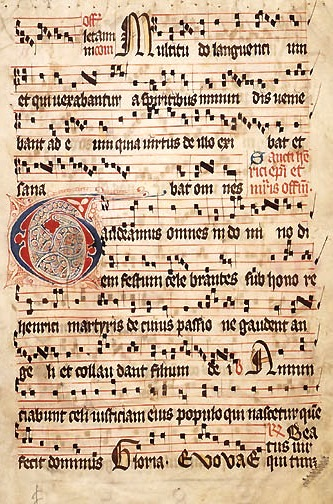
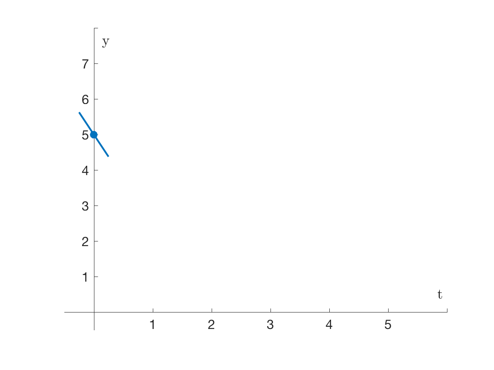
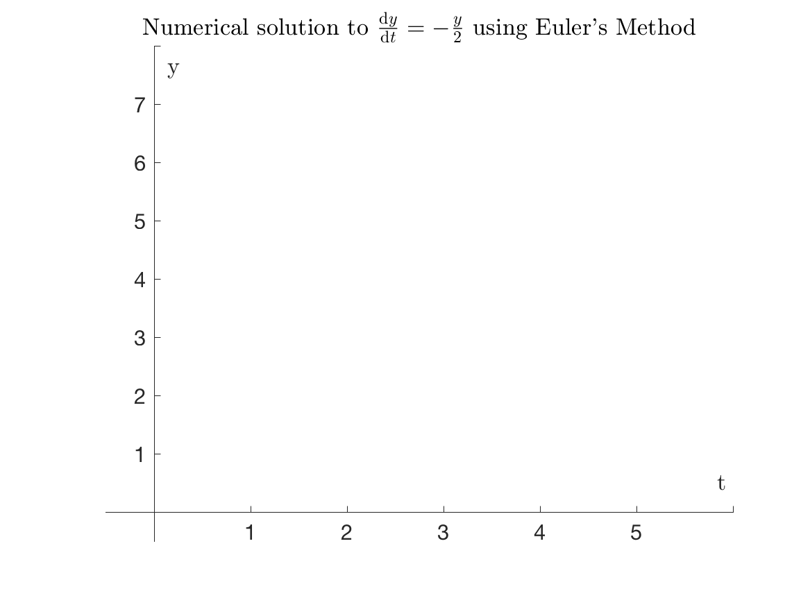

## Today's Topics

 * Recap on last week
 * Control flow
 * Loops
 * Creating your own functions

---

## Recap: Plotting

Matplotlib's `plot` function takes two arrays and produces a 2D plot:

```python
import numpy as np
import matplotlib.pyplot as plt
x = np.linspace(0, 2*np.pi, 100)
y = np.sin(x)
plt.plot(x, y)
```

---

{width="70%"}

*[Download the full source code for this plot.](code/lecture_sine1.py){target="_blank"}*

---

Methods such as `xlabel`, `ylabel` and `title` can be used to make the plot look nice:

```python
plt.xlabel('x')
plt.ylabel('y')
plt.title('y = sin(x)')
plt.xlim(0, 2*np.pi)
```

{width="70%"}

*[Download the full source code for this plot](code/lecture_sine2.py){target="_blank"}*


---

## Control Flow

Control flow statements are used to determine if and when commands in your code are carried out. Control flow is part of the staple diet for almost all programming languages.


. . .

We're going to look at three types of construct which control the flow of a piece of computer code:


* If statements
* For loops 
* While loops 


---


### Control flow concepts

Let's consider these in turn conceptually, before we look at the Python syntax.

---


### If statements

An **if** statement is used to specify that a command(s) that is only executed if a condition is satisfied.

Note: in case it isn't clear, these are not Python commands! This is a made-up language called *pseudocode*.

``` 
If something is true
  Do something
```

. . .

e.g. Choosing what you do on the metro:

``` 
If it is Monday
  Listen to music
```

---

This can be extended to **if...else** statements:

``` 
If something is true
  Do something
else
  Do something else
```

. . .

e.g. Choosing what you do on the metro:

``` 
If remembered to bring headphones
  Listen to music
else
  Read the newspaper  
```

---


### For loops

A for loop repeats a specified command or list of commands several times in succession

``` 
For some list of things
  Do something
```

. . .

e.g. reading a newspaper on the metro

``` 
For each page in the Metro newspaper
  Read the page
```

---


The for loop can contain many commands. And often there is a counter: here it might be our page number

``` 
For x = each page in the Metro newspaper
  Read page x
  Check location on the metro map
  Check phone for messages
```

---

### While loops

A while loop is similar to a for loop, but in this case the loop is repeated only whilst a condition is satisified.

``` 
While something is true
  Do something
```

. . .

E.g. reading a newspaper til you reach your destination:

``` 
While on the train
  Read a newspaper page
  Turn to the next page
```

---

Note that if you need a counter then you need to set it yourself

``` 
x = 0
While on the train
  x = x + 1
  Read page x
```

---

Similar ideas have been used in music for many centuries...

{width=30%}

---

{width=60%}

---


---

## Control flow in Python

Now let's take a look at control flow in Python

---

### If statements

```runnable lang="python"
x = 2
if x > 0:
    print('it is true')  # Print something if true
```

Note that it is required to indent the contents of the `if` statement!

---


### For loops

```runnable lang="python"
for i in range(1,6):
    print(i)  # useful function to display i
```

---

### While loops

```runnable lang="python"
x = 0
while x < 5:
    x = x + 1
    print(x)  # display x at this iteration
```

---

## Applications of control flow

Loops and if statements are essential blocks of computer code and we'll have a look at some examples of how to use them in the handout this week.

Here's an example of plotting multiple curves, adapting and example from last week.

---

```python
import numpy as np
import matplotlib.pyplot as plt

# Create the x axis
x = np.linspace(0, 6, 200)

# Create 3 plots in a loop
for i in range(1, 4):
    plt.plot(x, np.sin(i*x))

# Add axis labels etc.
```

---

{width="80%"}

*[Download the full source code for this plot](code/lecture_sine3.py){target="_blank"}*

---

## Functions

* So far we have made use of a variety of built-in functions. And today we are going to see how to create our own.

* Splitting up computer code by writing user-defined functions is a very good idea, and Python has a couple of options for separating chunks of code out into a function.

----

The syntax for creating a function is as follows:

```python
def my_func():
    print("My function prints this")
```
 . . .

Note a similar syntax and indenting as for control flow
 
 . . .

The function begins with the keyword `def` and then the function name "my_func".
 
 . . .

Input arguments are defined inside brackets - for this function there are none
  
. . .

Once defined, we can use the function by running:

```python
my_func()
```

---

Let's add an argument:

```python
def square_a_number(x):
    return x**2
```

. . .

The argument `x` has been added. You provide a value for it when you "call" the function
 
 . . .

The `return` statement controls what value (or values) your function outputs

---

```python
x = square_a_number(3)
print(x)
```
```output
9
```

---

## Handling errors 

During your work in the practicals, you have probably encountered a bit of red text and errors that occur when you run commands Python has a problem with.

{style="80%"}

You can create your own error messages in your code too!

----

The `raise` function displays a message in red, and halts execution of the code.

```python
raise(Exception('This is a custom error message!'))
```

---

For example,

```python
def do_sqrt(x):
    if x < 0:
        raise(Exception("Sorry, no imaginary numbers here!"))
    else:
        return x**0.5
```

. . .

{style="80%"}

---

## Adding help

A comment contained within three quotes ```"""``` at the start of our custom function is used to display help. It is known as a *docstring* (documentation string)

```python
import numpy as np
import matplotlib.pyplot as plt
def sin_plus_cos(x):
    """ Takes in a value x and 
        returns cos(x)+sin(x) """
    return np.cos(x)+np.sin(x)
```

Test your help with

```
help(sin_plus_cos)
```


---

## Algorithmic thinking

**algorithm**<br/>*noun*<br/>a process or set of rules to be followed in calculations or other problem-solving operations, especially by a computer.

. . .

The following is a worked example...

---

## Numerical Solutions to differential equations

Differential equations play a part in almost every model of physical processes: from the fundamental laws of physics, to population growth, chemical reactions and economic modelling.

. . .

We are (or at least you will be later on) interested in solving differential equations, for example
$$ \frac{\mathrm{d}y}{\mathrm{d}t}=-\frac{y}{2}, \quad y(0)=5 $$


---

### Why Python?

* This problem can be solved using pen and paper, but that is not always the case!
* We can use Python as a powerful visualisation tool 

---

### Euler's Method

Let's derive a method to solve this ODE on a computer, simply by applying some problem solving...

---


### &nbsp; {: data-transition="none"}

$$ \frac{dy}{dt}=-\frac{y}{2}, \quad y(0)=5 $$

{width=55%}


What's our goal?

### &nbsp; {: data-transition="none"}
$$ \frac{dy}{dt}=-\frac{y}{2}, \quad y(0)=5 $$
{width=55%}

We want to know how $y$ evolves with $t$.

### &nbsp; {: data-transition="none"}
$$ \frac{dy}{dt}=-\frac{y}{2}, \quad y(0)=5 $$
{width=55%}

What do we know?

### &nbsp; {: data-transition="none"}
$$ \frac{dy}{dt}=-\frac{y}{2}, \quad y(0)=5 $$ 
{width=55%}

$$y(0)=5$$

### &nbsp; {: data-transition="none"}
$$ \frac{dy}{dt}=-\frac{y}{2}, \quad y(0)=5 $$
{width=55%}

$$\frac{\mathrm{d}y}{\mathrm{d}t}(0)=-\frac{5}{2}$$

### &nbsp; {: data-transition="none"}
$$ \frac{dy}{dt}=-\frac{y}{2}, \quad y(0)=5 $$
{width=55%}

Suppose we use this to estimate the position of $y(1)$


### &nbsp; {: data-transition="none"}
$$ \frac{dy}{dt}=-\frac{y}{2}, \quad y(0)=5 $$
{width=55%}

$y(1) = 5 -\left(\frac{5}{2}\right)h$, where $h$ is the separation in $t$


### &nbsp; {: data-transition="none"}
$$ \frac{dy}{dt}=-\frac{y}{2}, \quad y(0)=5 $$
{width=55%}

$$y(1) = \frac{5}{2}$$


### &nbsp; {: data-transition="none"}
$$ \frac{dy}{dt}=-\frac{y}{2}, \quad y(0)=5 $$
{width=55%}

$$\frac{\mathrm{d}y}{\mathrm{d}t}\left(\frac{5}{2}\right)=-\frac{5}{4}$$
 


### &nbsp; {: data-transition="none"}
$$ \frac{dy}{dt}=-\frac{y}{2}, \quad y(0)=5 $$
{width=55%}

And so on...


 
### &nbsp; {: data-transition="none"}
$$ \frac{dy}{dt}=-\frac{y}{2}, \quad y(0)=5 $$
{width=55%}

And so on...

---

{width=80%}

---

How does this compare to the exact solution?

---

$h = 1$

{width=80%}

---

$h = 0.5$

{width=80%}

---

$h = 0.25$

{width=80%}

---

### Euler's Method Algorithm

For first order differential equations of the form

$$ \frac{dy}{dt}=f(y,t). $$

Euler's Method approximates the solution using

$$ y_{n} = y_{n-1} + hf(y_{n-1},t_{n-1}). $$


---

We can write our algorithm for this problem as:

$$ f(y)=-\frac{y}{2}, \quad y_{n} = y_{n-1} + hf(y_{n-1}), \quad y_0=5 $$

as a function

```python
def f(y):
    return -y/2
```

and a for loop (I've chosen $h=0.5$)

```octave
y = np.zeros(10)
y[0] = 5
for n in range(1, 10):
    y[n] = y[n-1]+0.5*f(y[n-1])
print(y)
plt.plot(y)
```

---

## Lecture 3 Summary

Creating our own functions and being able to control when commands are used using loops and if statements will bring us new powers to process data, plot and more. In the handout we'll apply some of these ideas to some more *algorithms*. 

